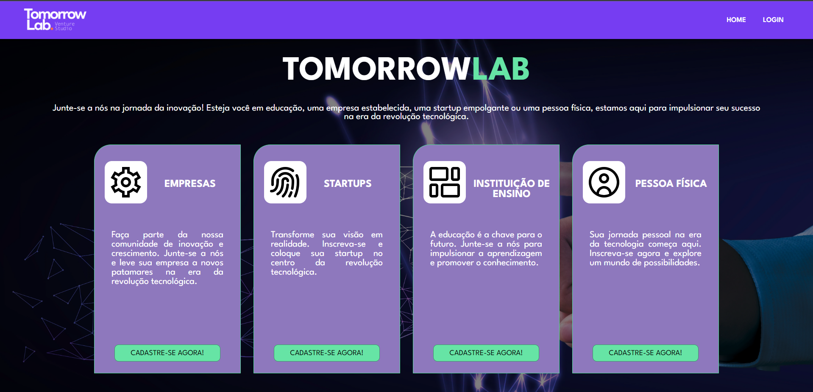
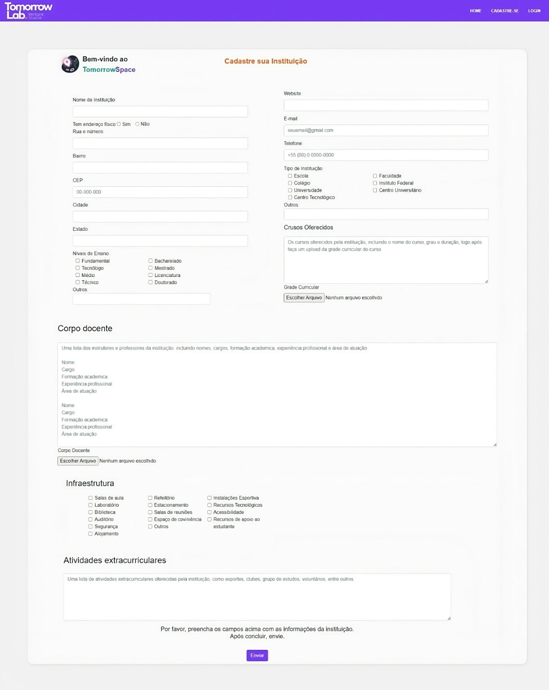
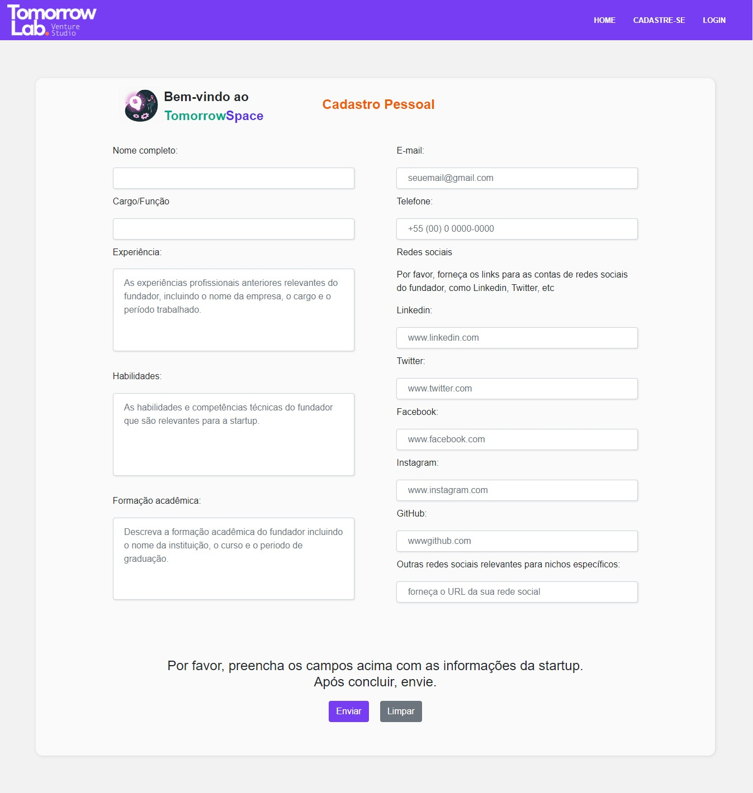
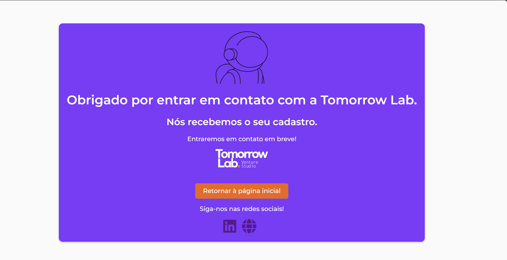

# TomorrowLab
## Residência Porto Digital
.png)

Criação de uma plataforma de cadastro para captação de players proporcionando maior visibilidade para o desenvolvimento de ideias e soluções inovadoras, gerando parcerias e conexões tecnológicas.

## Índice 
- <a href="#-projeto">Funcionalidades do projeto<a>

- <a href="#-tecnologias utilizadas">Tecnologias utilizadas<a>

- <a href="#-tecnologias utilizadas">Pessoas autoras<a>

- <a href="#-Site">Site<a>

## 💻Funcionalidades do Projeto
- [x] Tela de Home
- [x] Tela de Personas
- [x] Cadastro de Empresas
- [x] Cadastro de Startup
- [x] Cadastro de Instituição de Ensino
- [x] Cadastro de Pessoa Física
- [x] Tela de Agradecimento

##

### Tela de Home

- Ao entrar na tela de home convidamos os players interessados na venture studio que são Empresas, Instituições de ensino, Startups e Investidores para se cadastrarem no nosso site.

- Os interessados devem clicar no botão "Cadastre-se" sendo direcionado para tela de personas.

##

### Tela de Personas

- Na tela de personas o usuário escolhe qual é sua categoria, podendo escolher Empresas, Startup, Instituição de ensino ou Pessoa física.

- Deve clicar no botão "Cadastre-se agora" ao escolher por qual player se identifica.

- Na tela também exibe a opção home e login, ao clicar em home é direcionado para tela principal e login é uma funcionalidade futura.

##

### Cadastro de Empresas

- No cadastro de Empresa, o usuário deve preencher todos os campos, ao inserir todas as informações é necessário clicar no botão "Enviar"

.jpeg)

##

### Cadastro de Startup

- No cadastro de Startup, o usuário deve preencher todos os campos, ao inserir todas as informações é necessário clicar no botão "Enviar"

##

### Cadastro de Instituição de Ensino
- No cadastro de Instituição de ensino, o usuário deve preencher todos os campos, ao inserir todas as informações é necessário clicar no botão "Enviar"

##

### Cadastro de Pessoa Física
 - No cadastro de Pessoa física, o usuário deve preencher todos os campos, ao inserir todas as informações é necessário clicar no botão "Enviar"

##

### Tela de Agradecimento
- É exibido uma tela de agradecimento pelo cadastro enviado. 
- O usuário pode voltar a tela inicial ao clicar em "Retornar à página inicial" 
- Também é exibido redes sociais disponíveis da Empresa TomorrowLab

## 🔗 Tecnologias Utilizadas

&nbsp; &nbsp;&nbsp;

&nbsp;
&nbsp;
&nbsp;

## 🌐 Site 

[Site](https://tomorrowlab.studio/portodigital/)

## 📌Pessoas Autoras

[def]: ./Páginas/img/TELA.STARTUP.jpeg